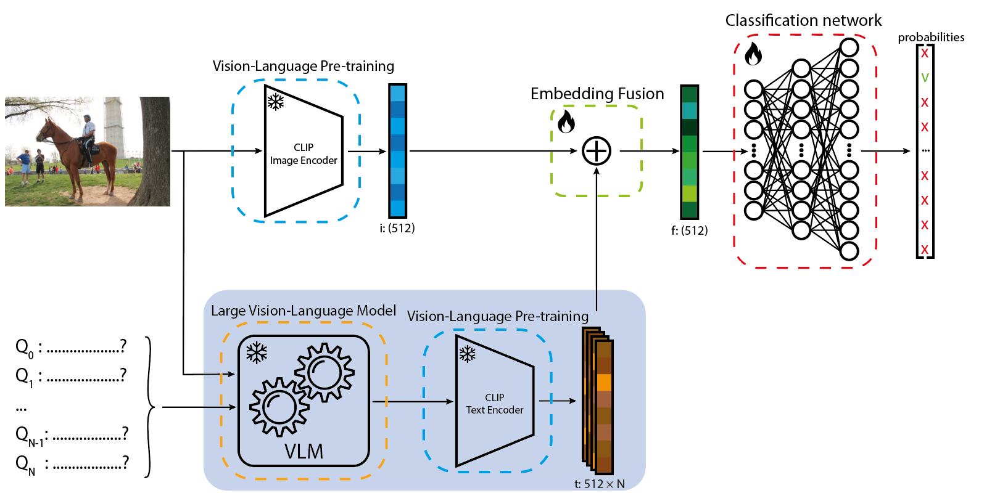

# Introduction:
This repository contains all the attributes of my bachelor thesis project. In this project I have used CLIP image embeddings together with CLIP text embeddings of synthetic text features generated by the large vision-language model LLaVA-v1.6-34b to perform Human-Object Interactions (HOI) classification. The CLIP model being used is the huggingface clip-vit-base-patch32.



# Reproduction instructions:
Clone this repository to a folder of your choice. Add the hico_20150920 folder that can be downloaded from [the HICO website](https://websites.umich.edu/~ywchao/hico/) to the same folder as this repo is in. While this website is currently not available the dataset can still be downloaded from their [google drive link](https://drive.google.com/uc?export=download&id=1SSWJZaczRNYeUSEkIzJb019YaVUagt3J) directly.


This should result in the following directory structure:
```
Your Folder/
├── VLM-enhanced-HOI-recognition/
|   ├── anno/
|   └── ...
└── hico_20150920/
    ├── images/
    └── anno.mat
```
`VLM-enhanced-HOI-recognition/anno/` contains the original matlab tables of `hico_20150920/anno.mat` in csv and text form. Additionally the list of HOIs, list of verbs and list of objects from the [HICO website](https://websites.umich.edu/~ywchao/hico/) are in anno/added/ together with a json version of list_action that was also in the anno.mat. The rest of the files in anno/added are generated by the annotation preprocessing script.

## install the dependencies:
python version: 3.10.13

```
pip install --extra-index-url https://download.pytorch.org/whl/cu118 -r requirements.txt
```
The extra-index-url is used to download the cuda version of pytorch which allows for GPU acceleration.

## Data generation steps:
1. run `Utils/image_embedding.py`
2. run `Utils/vlm_answer_processing.py`
3. run `Utils/text_embedding.py`
4. run `Utils/combined_embedding.py`
5. run `Utils/annotation_preprocessing.py`

## Run experiments:
When all the data is generated, running an experiment is as easy as running the whole Jupyter notebook.

Note that there are training and testing notebooks. Training notebooks are used to find the convergence point. These models are trained on 80% of the HICO trainingset and validated on the other 20%. The test notebooks are trained on the whole hico trainingset and tested on the provided HICO test set.

## VLM prompt:
The prompt we used can be found in `Notes/question-prompts`. All the text in this file is sumbitted to the VLM as a single prompt.

# Details:
Details can be read in my thesis that is publically available on {TOBEADDED}

# How to cite?
If you find this repository usefull for your project please cite as {TOBEADDED}

